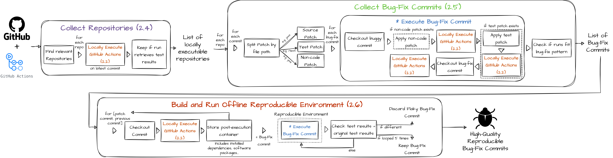

# GitBug-Actions

GitBug-Actions is a tool that builds bug-fix benchmarks by leveraging GitHub Actions.
The tool mines GitHub repositories and navigates through their commits, locally executing GitHub Actions using [act](https://github.com/gitbugactions/act) in each commit considered.
Finally, the tool checks if a bug-fix pattern was found by looking at the test results parsed from the GitHub Actions runs. 
If a bug-fix is found, GitBug-Actions is able to export a Docker image with the reproducible environment for the bug-fix.
The reproducible environment will preserve all the dependencies required to run the tests for the bug-fix, avoiding the degradation of the benchmark due to dependencies that become unavailable.

If you use GitBug-Actions, please cite:

[GitBug-Actions: Building Reproducible Bug-Fix Benchmarks with GitHub Actions](http://arxiv.org/pdf/2310.15642) ([doi:10.1145/3639478.3640023](https://doi.org/10.1145/3639478.3640023))

```
@inproceedings{gitbugactions,
 title = {GitBug-Actions: Building Reproducible Bug-Fix Benchmarks with GitHub Actions},
 year = {2024},
 doi = {10.1145/3639478.3640023},
 author = {Saavedra, Nuno and Silva, Andr{\'e} and Monperrus, Martin},
 booktitle = {Proceedings of the ACM/IEEE 46th International Conference on Software Engineering: Companion Proceedings},
}
```

## Requirements

### Act

It is required to have [act](https://github.com/gitbugactions/act) installed and functional.
At the moment, GitBug-Actions only works correctly with the modified version of `act` available [here](https://github.com/gitbugactions/act).
Other versions will work but some issues may arise.

To install this version:
```
git clone https://github.com/gitbugactions/act
cd act
make build
```

A binary file `dist/local/act` will be created. This binary file should be made available in the `$PATH` of the system:
```
export PATH="<REPLACE_WITH_PATH_TO_ACT>:$PATH"
```

### Python dependencies

GitBug-Actions runs on Python3.12 and above.

Ensure Poetry is [installed](https://python-poetry.org/docs/#installation).

Then, to install the Python dependencies run:
```
poetry shell
poetry install
```

## How to run

Ensure the commands are executed inside the Poetry shell:

```
poetry shell
```

Set the environment variable `GITHUB_ACCESS_TOKEN` with your [GitHub access token](https://docs.github.com/en/authentication/keeping-your-account-and-data-secure/managing-your-personal-access-tokens). The token is used to perform calls to GitHub's API.
```
export GITHUB_ACCESS_TOKEN="<YOUR_ACCESS_TOKEN>"
```

Use the `--help` command to obtain the list of options required to run each script.

```
python collect_repos.py --help
python collect_bugs.py --help
python export_bugs.py --help
python filter_bugs.py --help
```



The figure above provides an overview of the pipeline of GitBug-Actions.

The scripts above should be executed in the same order shown on the figure. 
`collect_bugs` will use the repositories found by `collect_repos` as input.
`export_bugs` uses the bug-fixes found by `collect_bugs` as input.
Finally, `filter_bugs` uses the bug-fixes found by `collect_bugs` and the containers exported by `export_bugs` as input.
The output of `filter_bugs` is a file with a list of non-flaky bug-fixes able to be reproduced in the exported containers.

## Tests

To run the tests:

```
pytest test -s
```

## Practical Challenges

While developing GitBug-Actions, we found some challenges of running CI builds at a large scale. 
Here we enumerate these challenges and explain how we mitigate them and, in cases that was not possible, **how the user should handle them**.

### Handling Commits without GitHub Actions

One challenge in collecting bug-fix commit pairs by reproducing GitHub Actions is that GitHub Actions were only released in late 2019.
Moreover, albeit being the most popular as of 2023, its adoption was not immediate.
As a result the majority of commits found on GitHub do not have any associated workflows.

To increase the number of supported commits by GitBug-Actions, it identifies the oldest locally reproducible GitHub Action for each project.
Then, for commits not associated with GitHub Actions, GitBug-Actions uses these as an approximation of the intended configuration.

### Disk Space Management

Build execution has the potential to exhaust available disk space.
To mitigate this, we restrict each build's allocation to a maximum of 3GiB. This restriction is handled by our version of [act](https://github.com/gitbugactions/act).

However, users are advised to check disk usage frequently and remove dangling docker containers/images in case they occur. Additionally, users should take special attention to docker volumes which are not automatically removed by act, and can accumulate over time.

Example of how to remove dangling containers and volumes created by act:
```bash
# Remove containers
docker rm $(docker stop $(docker ps -a -q --filter ancestor=gitbugactions:latest --format="{{.ID}}"))
# Remove volumes
docker volume ls -q | grep '^act-' | xargs docker rm
```

### Concurrent File Access

CI builds may initiate concurrent file access operations, a situation that can escalate to the point of surpassing the user-level open-file limit set by Linux.
This is exarcebated when running multiple builds in parallel.
To overcome this, we recommend setting the open-file limit for your user profile to a higher threshold than the default.

To check the current limit for your user run `ulimit -Sn`.

## Contributing

Pull requests are welcome. For major changes, please open an issue first
to discuss what you would like to change.

Please make sure to update tests as appropriate.

## License

[MIT](LICENSE)
